<p align="center">
  
</p>

<p align="center">
  <a href="README.ja.md">日本語</a> ·
  <a href="https://sunwood-ai-labs.github.io/codex-remote-control-lab/">Docs</a> ·
  <a href="https://github.com/Sunwood-ai-labs/codex-remote-control-lab">GitHub</a>
</p>

<p align="center">
  
  
  
  
</p>

# Codex Remote Control Lab

Codex Remote Control Lab turns your phone into a remote control for the Codex session running on your desktop. Start the bridge on the Mac, open the tokenized URL from a phone, and continue the same Codex thread from either device.

It is a local-first experiment for OpenAI Codex CLI `remote-control` and `app-server` workflows. It keeps the Codex app-server on `127.0.0.1`, then exposes only a small token-protected browser bridge to devices on the same LAN.

## ✨ What It Does

- starts a repository-local Codex CLI `0.130.0` app-server
- lets a phone browser operate the desktop Codex app-server without exposing that app-server directly to the LAN
- syncs one active Codex thread between desktop and phone, so you can start on the PC, step away, and keep working from mobile
- serves a phone-friendly browser UI with thread resume, artifact preview, approvals, model selection, image attachments, and selectable color themes
- shares one bridge-managed Codex thread across a phone and desktop browser
- keeps `.phone-token`, `.uploads/`, `.codex-home*/`, logs, and session databases out of Git
- publishes bilingual docs through VitePress and GitHub Pages

## 🚀 Quick Start

```bash
git clone https://github.com/Sunwood-ai-labs/codex-remote-control-lab.git
cd codex-remote-control-lab
npm ci
npm run phone
```

The command prints masked bridge URLs like this:

```text
http://192.168.11.8:45214/?token=abcd…wxyz
```

Open a private tokenized startup URL from your protected notification channel, or open the bridge URL and enter the token from your local `.phone-token` / `PHONE_TOKEN` source.

## 🧭 Architecture

```text
phone browser -> http://Mac-LAN-IP:45214 -> Node bridge -> ws://127.0.0.1:45213 -> Codex app-server
```

The safer boundary is intentional: Codex's app-server remains bound to localhost; only the small token-protected bridge is reachable from the LAN.

## 🧪 Verification Commands

```bash
npm run check
npm run docs:build
npm audit --omit=dev
```

Protocol-only smoke test:

```bash
npm run server:ws
npm run probe:ws
```

The local smoke test verified `initialize` and `thread/start` through the WebSocket app-server, plus `/readyz` and `/healthz` behavior.

## 📱 Phone Bridge

The main value of the bridge is continuity: the desktop keeps running Codex locally, while the phone becomes a LAN remote for that same session. The bridge-managed thread can be opened from both the PC browser and the phone browser, making the workflow feel synced instead of split across devices.

Useful environment variables:

```bash
PHONE_UI_PORT=45214 npm run phone
PHONE_UI_PORT=45224 PHONE_WORKDIR=/Users/admin/Prj/some-project PHONE_APP_NAME="Slot 45224" PHONE_APP_ID=slot-45224 npm run phone
PHONE_BRIDGE_ID=work-a PHONE_BRIDGE_LABEL=WorkA PHONE_BRIDGE_GROUP=client PHONE_BRIDGE_COLOR=#2f6f2f npm run phone
npm run phone:fleet
PHONE_AGENT_PROVIDER=claude npm run phone
PHONE_WORKDIR=/Users/admin/Prj/some-project npm run phone
CODEX_MODEL=gpt-5.4 npm run phone
CLAUDE_MODEL=sonnet npm run phone:claude
CODEX_APP_SERVER_SOCK=/Users/admin/.codex/app-server-control/app-server-control.sock npm run phone
CODEX_APP_SERVER_URL=ws://127.0.0.1:45213 npm run phone
CODEX_HISTORY_SYNC=0 npm run phone
PHONE_TOKEN=choose-your-own-token npm run phone
PHONE_NTFY_TOPIC=your-private-topic npm run phone
PHONE_PUSHOVER_TOKEN=app-token PHONE_PUSHOVER_USER=user-key npm run phone
PHONE_DISCORD_WEBHOOK_URL=https://discord.com/api/webhooks/... npm run phone
PHONE_NOTIFY_TIMEOUT_MS=5000 npm run phone
```

To run multiple phone bridges in parallel, start them on different `PHONE_UI_PORT` values and usually pin each port to a different `PHONE_WORKDIR` worktree. The port is the stable workspace slot; the browser UI can switch between Codex and Claude within that slot. When `CODEX_APP_SERVER_PORT` is not set, each slot uses `PHONE_UI_PORT - 1` for its local Codex app-server, such as `45224 -> 45223`, so slots do not fight over the `45214 -> 45213` default. Settings saved from the browser UI are stored as port-scoped `.env` keys such as `PHONE_WORKDIR_45224`, so changing one slot does not rewrite every port's default worktree. `PHONE_AGENT_PROVIDER` only chooses the default provider opened after restart. Each bridge has its own active queue and PWA identity, so multiple URLs can be added to the iPhone Home Screen as separate icons. Set `PHONE_APP_NAME`, `PHONE_APP_SHORT_NAME`, and `PHONE_APP_ID` when you want a slot label such as `Slot 45224`. If iOS already cached an older icon, delete that Home Screen icon and add the URL again.

Bridge Fleet / Worktree Switchboard lets one browser tab register several bridge URLs, switch the active worktree, and monitor running/error/approval state across inactive bridges. Open one bridge as usual, tap the current bridge/worktree pill, and paste protected startup URLs or base URLs plus tokens. Tokens are masked in the UI; saved host profiles keep base URLs and metadata separate from the local device token store, and session-only tokens stay in `sessionStorage`. Each bridge also exposes token-protected `GET /api/bridge/info` metadata for label, port, cwd, branch, dirty summary, model, and fleet capabilities.

For repeatable local startup, create `.phone-fleet.local.json` and run `npm run phone:fleet`. That file is ignored by Git and should contain only local worktree paths and ports. Add `"provider": "codex"` or `"provider": "claude"` to a bridge entry when that slot should stay pinned after restart. The launcher starts each bridge with scoped `PHONE_UI_PORT`, `CODEX_APP_SERVER_PORT`, `PHONE_AGENT_PROVIDER`, `PHONE_BRIDGE_*`, and `PHONE_WORKDIR` values, then you add the protected startup URLs or base URLs plus tokens to the Fleet UI. In fleet mode, settings saved from the browser UI also update the matching `.phone-fleet.local.json` entry so workdir/model/provider changes survive the next fleet restart.

`CODEX_APP_SERVER_SOCK` or `CODEX_APP_SERVER_URL` makes the bridge attach to an existing headless app-server instead of starting a new one. For live sync with Codex Desktop, use this with a Desktop Remote Connection that points at the same headless app-server. The normal local conversation view in Codex Desktop uses a private `stdio` app-server, so there is no public external route for a bridge to inject live UI updates into that local view.

Set `PHONE_AGENT_PROVIDER=claude` or run `npm run phone:claude` when you want Claude to be the default provider for a slot. The provider can still be changed from the browser UI without changing the slot worktree. Claude turns use `claude -p --output-format stream-json` and resume with Claude's session ID after the first response. Claude mode reads same-workdir Claude Code JSONL sessions for its sidebar and thread resume, but it does not expose Codex thread history, plugin lookups, or live approval callbacks; choose `CLAUDE_PERMISSION_MODE` or the UI permission mode before sending a turn.

History sync is enabled by default. After a web turn completes, the bridge warms the app-server history with `thread/read` and a scan-backed `thread/list`, and `/api/threads` also avoids state-DB-only listing. This helps Codex Desktop discover the updated session after reopening or refreshing the thread. It does not inject live updates into an already-open normal Desktop conversation view. Set `CODEX_HISTORY_SYNC=0` to disable the extra history refresh calls.

Notifications are opt-in. `PHONE_NTFY_TOPIC` sends startup URLs to an ntfy topic, `PHONE_PUSHOVER_TOKEN` plus `PHONE_PUSHOVER_USER` sends them through Pushover, and `PHONE_DISCORD_WEBHOOK_URL` posts them to Discord. Task completion/interruption notifications are sent through configured providers. Set `PHONE_NOTIFY_EVENTS=1` to also send structured work events such as `approval_required`, `question_required`, `test_failed`, `connection_lost`, `history_sync_failed`, and `long_running`; `PHONE_NOTIFY_EVENT_DEDUPE_MS` controls short-window dedupe for non-forced events. Startup notifications can include the tokenized ready URL for compatibility, so use a private/protected topic, account, or channel. Event notifications use token-free bridge URLs.

The current phone bridge supports:

- Codex Desktop-like browser layout with a left thread sidebar, central conversation, right artifact panel, and bottom composer
- recent thread listing and direct thread resume
- Bridge Fleet / Worktree Switchboard for registering multiple bridge profiles in one tab
- global running monitor and global approval inbox across registered bridges
- per-thread accent colors saved in browser local storage, so concurrent work is easier to distinguish
- Codex / Terminal view switching, with Terminal reserved for manual command input and output instead of chat status logs
- a mobile cockpit header with state, position, per-thread color, compact path, and a mini thread switcher
- mobile-width thread switching through guarded horizontal swipes, the header previous/next buttons, or the position pill
- a phone-first terminal view with an active-workspace prompt, filter chips, search, copy-visible-output, auto-scroll pause, font controls, safe key-intent chips, and focus mode
- sticky approval cards visible from chat and terminal views, with larger approve/reject controls and terminal transcript feedback
- quick action chips that insert common follow-up prompts without auto-sending
- default history-sync refresh for Desktop reopen/refresh continuity
- plugin, model, config/auth, and automation status panels
- approval and sandbox mode controls for the next turn
- Markdown rendering in chat and artifact previews
- Markdown image links rendered inline where possible
- browser-selected image attachments sent as Codex `localImage` inputs
- local repository image artifacts served through token-protected file routes
- collapsed status/tool logs with expandable detail rows
- simple, cyberpunk, and botanical color themes saved in browser local storage

The bridge safety boundary is unchanged: the Codex app-server stays on `127.0.0.1`, browser actions still go through the token-protected bridge, and the terminal controls do not expose arbitrary unauthenticated shell execution.

For positioning against the official mobile experience, see [Official Codex Mobile Comparison](docs/guide/official-codex-mobile-comparison.md).

## 🖼️ UI Evidence

Desktop-like layout:


Compact chat typography with image-link preview:

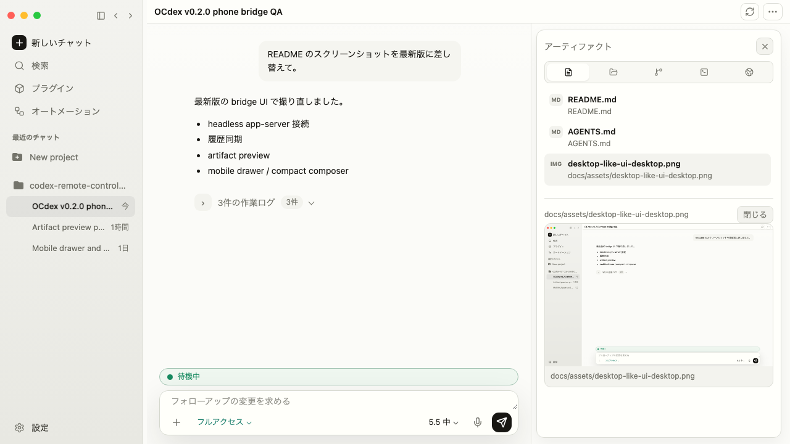

Theme comparison:

<table>
  <tr>
    <td align="center" width="33%">
      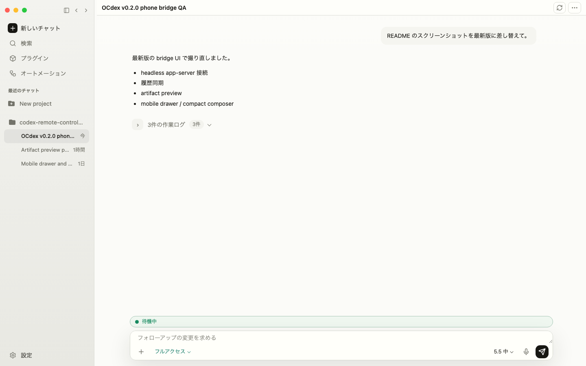<br>
      <sub>Simple desktop</sub>
    </td>
    <td align="center" width="33%">
      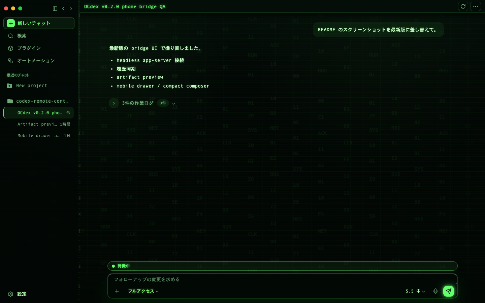<br>
      <sub>Cyberpunk desktop</sub>
    </td>
    <td align="center" width="33%">
      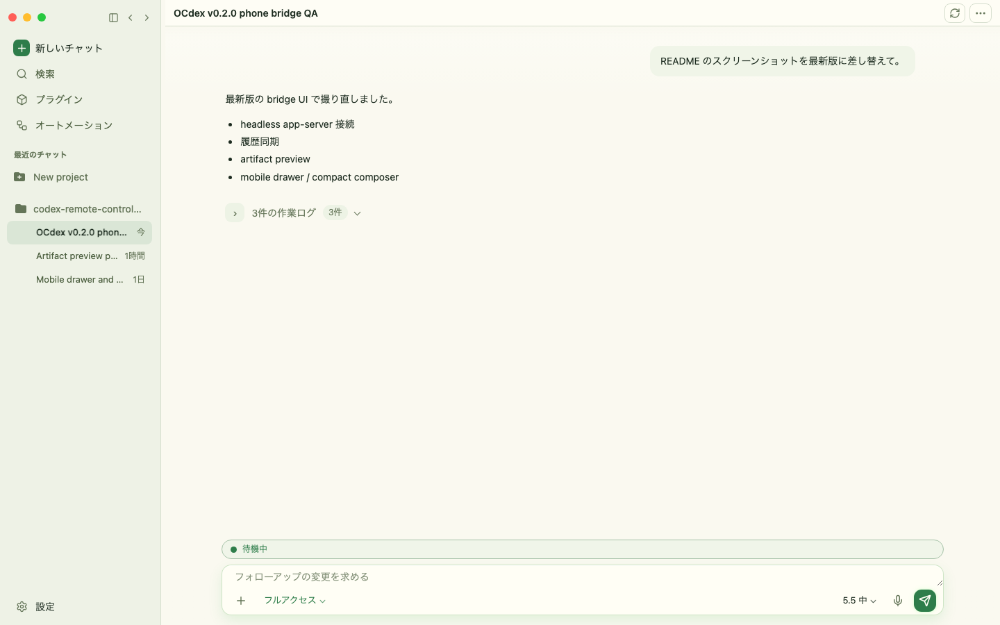<br>
      <sub>Botanical desktop</sub>
    </td>
  </tr>
  <tr>
    <td align="center" width="33%">
      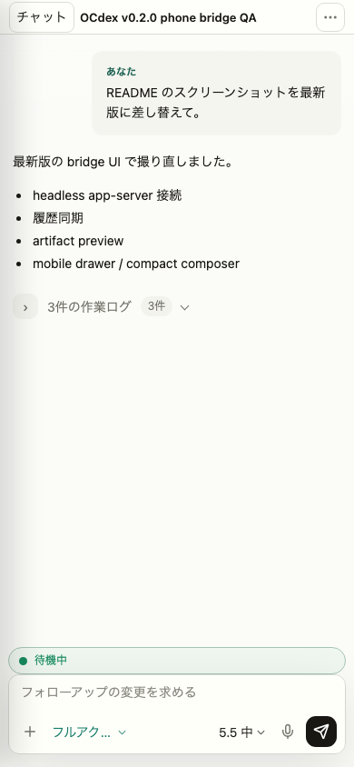<br>
      <sub>Simple settings</sub>
    </td>
    <td align="center" width="33%">
      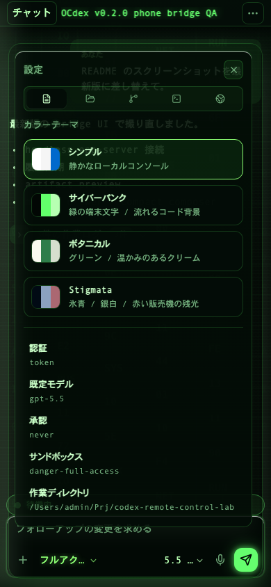<br>
      <sub>Cyberpunk settings</sub>
    </td>
    <td align="center" width="33%">
      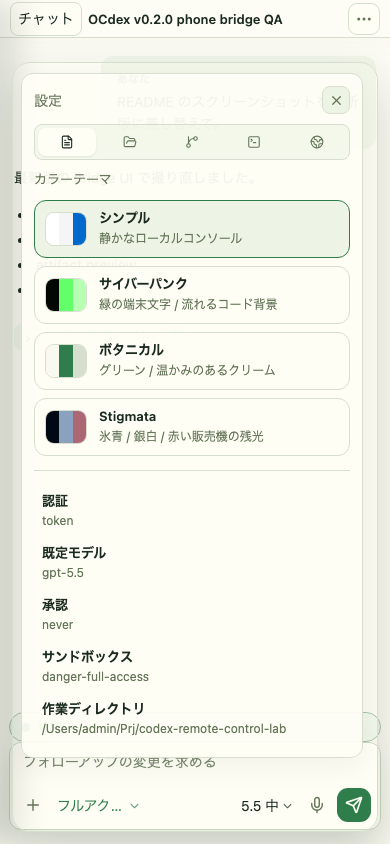<br>
      <sub>Botanical settings</sub>
    </td>
  </tr>
</table>

Mobile flow:

<table>
  <tr>
    <td align="center" width="33%">
      <br>
      <sub>Mobile layout</sub>
    </td>
    <td align="center" width="33%">
      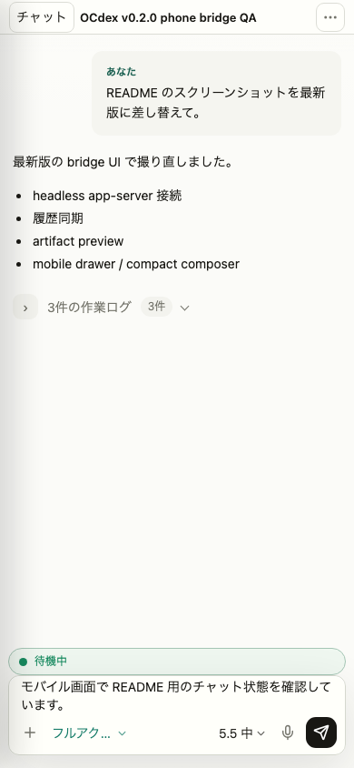<br>
      <sub>Responsive chat</sub>
    </td>
    <td align="center" width="33%">
      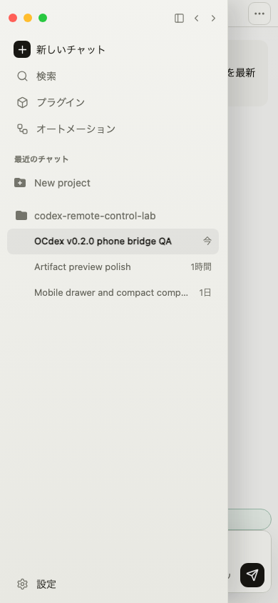<br>
      <sub>Thread drawer</sub>
    </td>
  </tr>
  <tr>
    <td align="center" width="33%">
      <br>
      <sub>Theme settings</sub>
    </td>
    <td align="center" width="33%">
      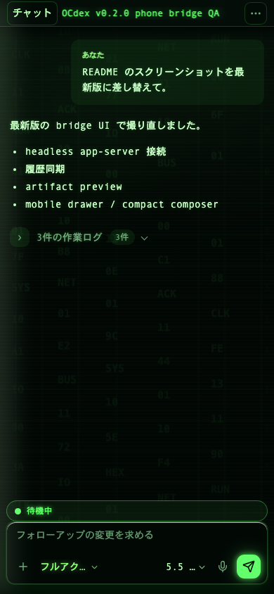<br>
      <sub>Composer controls</sub>
    </td>
    <td align="center" width="33%">
      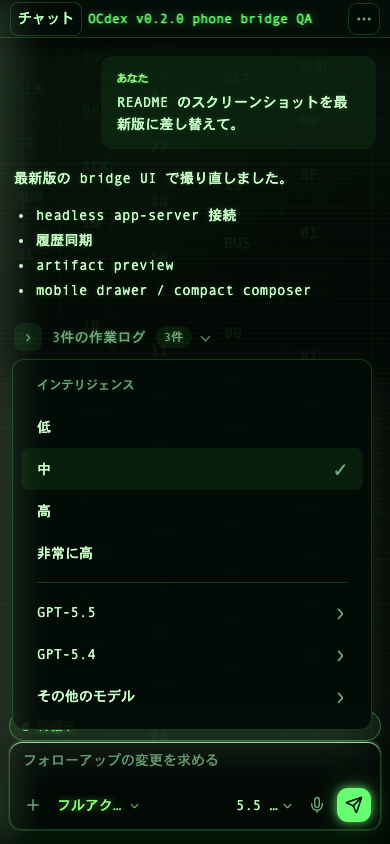<br>
      <sub>Model menu</sub>
    </td>
  </tr>
</table>

More screenshots are available in `docs/assets/` and through the artifact panel in the bridge UI.

## 🔐 Safety Notes

- Keep the Codex app-server on `127.0.0.1`.
- Do not bind an unauthenticated Codex app-server to a LAN or public interface.
- Treat any `?token=...` startup URL like a local access key. Do not post it in public issues, chats, screenshots, or streams.
- Stop the bridge with `Ctrl+C`. If you close the terminal or restart the PC, run `npm run phone` again.
- Use SSH forwarding, a VPN, or a mesh network for access outside a trusted LAN.
- Do not expose the bridge through an unauthenticated public tunnel or raw port forward.
- Delete `.phone-token` or set a new `PHONE_TOKEN` after demos on shared networks.

See [SECURITY.md](SECURITY.md) for the public-safe checklist.

## 📚 Documentation

- [English docs](https://sunwood-ai-labs.github.io/codex-remote-control-lab/)
- [日本語ドキュメント](https://sunwood-ai-labs.github.io/codex-remote-control-lab/ja/)
- [v0.2.0 release notes](https://sunwood-ai-labs.github.io/codex-remote-control-lab/guide/releases/v0.2.0)
- [Phone bridge guide](docs/guide/phone-bridge.md)
- [Protocol notes](docs/guide/protocol.md)
- [Security model](docs/guide/security.md)
- [Contributing and upstream PRs](docs/guide/contributing.md)

## 🗂️ Repository Layout

```text
public/              Browser UI served by the phone bridge
scripts/             Codex app-server probe and bridge launcher
docs/                VitePress docs and screenshot assets
docs/assets/         UI verification screenshots
docs/public/         Docs/README identity assets
.github/workflows/   CI and GitHub Pages deployment
```

## 📄 License

ISC. See [LICENSE](LICENSE).
